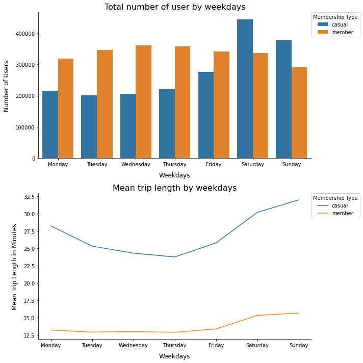
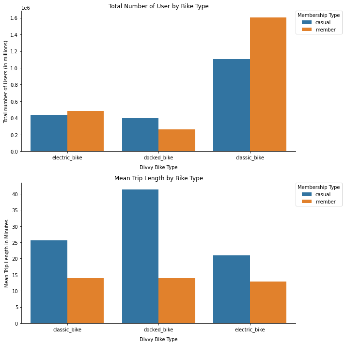
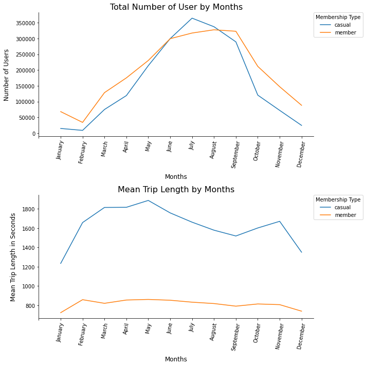

# Divvy-Bike-Share-Study-Case

## Description
The purpose of this notebook is to study the difference between members and casual types of user using the Divvy bike share service.

The data used is between **October 2020** and **September 2021**, and it contains the following variables:
  * ride_id: ID of the trip
  * rideable_type: Type of bicycle (electric, classic, docked)
  * started_at: Service start date and time (format: yyyy-mm-dd hh:mm:ss)
  * ended_at: Service end date and time (format: yyyy-mm-dd hh:mm:ss)
  * start_station_name: Start station name
  * start_station_id: Start station ID
  * end_station_name: End station name 
  * end_station_id: End station ID
  * start_lat: start latitude in decimal degrees
  * start_lng: start longitude in decimal degrees
  * end_lat: end latitude in decimal degrees
  * end_lng: end longitud in decimal degrees
  * member_casual: Type of user (member or casual)

>The Data has been made available by Motivate International Inc. under this [license](https://www.divvybikes.com/data-license-agreement). And, it can be found [here](https://divvy-tripdata.s3.amazonaws.com/index.html).

>Motivate International Inc. (“Motivate”) operates the City of Chicago’s (“City”) Divvy bicycle sharing service. The City permits Motivate to make certain Divvy system data owned by the City (“Data”) available to the public.

It should be noted that the Data does not allow differentiating the repetitive use of the services by a certain user or group of users. This is due to the data distribution policy.

## Divvy Service data statistical overview

| Membership Type | Count   | Count(%) | Weekday(mode) | Bike Type(mode) | Avg. trip time (hh:mm:ss) |
| :-------------: | :-----: |----------| :-----------: | :-------------: | :-----------------------: |
| Casual          | 1939201 | 45       | Saturday      | Classic         | 00:27:51                  |
| Member          | 2350846 | 55       | Wednesday     | Classic         | 00:13:42                  |

## Divvy Service use on weekdays

## Divvy Service use by bike type

## Divvy Service use by month

## Most frequent routes

### Casual

|       | Start Station              | End Station                | Count |
| :---: |  :----------------------:  | :------------------------: | :---: |
| 1     | Streeter Dr & Grand Ave    | Streeter Dr & Grand Ave    | 10559 |
| 2     | Milennium Park             | Millennium Park            | 5815  |
| 3     | Michigan Ave & Oak St      | Michigan Ave & Oak St      | 5569  |
| 4     | Lake Shore Dr & Monroe St  | Lake Shore Dr & Monroe St  | 5534  |
| 5     | Buckingham Fountain        | Buckingham Fountain        | 3507  |
| 6     | Theater on the Lake        | Theater on the Lake        | 3084  |
| 7     | Lake Shore Dr & Monroe St  | Streeter Dr & Grand Ave    | 3050  |
| 8     | Streeter Dr & Grand Ave    | Millennium Park            | 2957  |
| 9     | Indiana Ave & Roosevelt Rd | Indiana Ave & Roosevelt Rd | 2931  |
| 10    | Montrose Harbor            | Montrose Harbor            | 2838  |

### Member

|       | Start Station            | End Station              | Count |
| :---: |  :--------------------:  | :----------------------: | :---: |
| 1     | Ellis Ave & 60th St      | Ellis Ave & 55th St      | 2769  |
| 2     | Ellis Ave & 55th St      | Ellis Ave & 60th St      | 2471  |
| 3     | State St & 33rd St       | Calumet Ave & 33rd St    | 1440  |
| 4     | MLK Jr Dr & 29th St      | State St & 33rd St       | 1400  |
| 5     | Calumet Ave & 33rd St    | State St & 33rd St       | 1340  |
| 6     | Loomis St & Lexington St | Morgan St & Polk St      | 1335  |
| 7     | State St & 33rd St       | MLK Jr Dr & 29th St      | 1293  |
| 8     | Morgan St & Polk St      | Loomis St & Lexington St | 1214  |
| 9     | Loomis St & Lexington St | Halsted St & Polk St     | 1179  |
| 10    | Ellis Ave & 60th St      | University Ave & 57th St | 1137  |

## Summary
* The service was more use by members (55%) than by casual users (45%).
* The classic bikes type is the most popular type among users.
* The casual users spend more time on average than members. 
* The most active days for casual users are the weekends, and the members use the service more on the middle of the week.
* The service is more use in spring and summer months, and less use in winter and autumn.